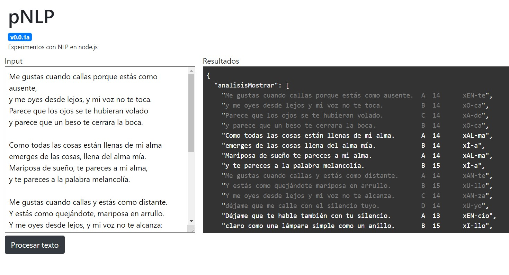

## Z nlp (codename)
This is the initial alpha version of these experiments, using NLP with node.js
In the end, this software will be able to generate complete poems and lyrics using some inputs as reference.

## Installation
- Clone repo
- npm install
- npm start

## Main references
- [Análisis del Poema](https://www.portaleducativo.net/octavo-basico/191/Analisis-del-poema)
- [El ritmo, la rima y la medida del poema](https://www.versoscompartidos.com/threads/el-ritmo-la-rima-y-la-medida-del-poema.8634)
- [Significado de Verso](https://www.significados.com/verso/)

- [Busca Palabras](https://buscapalabras.com.ar/)

## Main libs
- lorca.js
- TensorFlow (desirable)
- Keras (desirable)

## Screenshot

## MoSCoW
Following, the desirables for the project.
If you are willing to contribute, take one of them, create a branch and make a Pull Rquest when ready.

### Must Have
(spanish)
- Para la generación de los modelos de datos (NLP, ML)
   - GUI tipo sandbox
   - Análisis de textos introducidos por la GUI
   - Análisis de Rimas
   - Análisis de Ritmo
   - Análisis de Métricas
   - Análisis de temática
   - Análisis de sentimientos
   - Análisis de entidades
   - Análisis de intenciones
   - Catalogar, etiquetar y categorizar los contenidos
   - Generación de un primer modelo base

- Para la generación de contenido sintetizado (NLG, AI)

   - Definir las condiciones que determinen las predicciones
      - Categoría
      - Sentimiento
      - Forma verbal
      - Tipo de métrica
      - Tipo de rima
      - Tipo de versos
      - Adminitr configuración inicial del contenido
         - Aceptar palabras iniciales
         - Aceptar oraciones iniciales
         - Aceptar tiempos verbales
         - Aceptar persona / pronombre
         - Aceptar etiquetas

   - Entrenar el motor de AI en base a modelos
      - Predecir y sugerir segmentos de oraciones
      - Predecir y sugerir oraciones completas
      - Predecir y sugerir versos completos
      - Predecir y sugerir estrofas completas
      - Predecir y sugerir poemas completos
      - Predecir y sugerir líricas completas
   - Validar contenido generado

### Should Have
(spanish)
- Edición en sandbox
- Iteración en base a cambios en sandbox
- Guardar y recuperar contenidos generados
- Realimentar los modelos con los contenidos generados

### Could have
(spanish)
- Bot para twitter
- Bot para Telegram
- Sitio web de uso por suscripción
- Comunidad

### Will not have
- 

## Author
@jjyepez

Updated: 30/06/2020